## 基于通道混合的染色系统

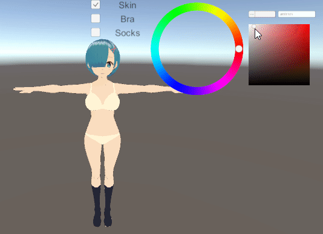

## 前言（指抄自哪里

基于知乎的这篇[《Unity手游开发札记——基于通道混合的角色染色系统实现》](https://zhuanlan.zhihu.com/p/52147126)，改进了自动生成通道混合的参数的算法，文章里那段Python代码计算出来的参数对于深色系的效果很差（几乎无效）。

最开始用大法师提供的hsv转rgb算法做的染色，也就是文章中的**基于HSV/HSL的染色**，但是效果不是很好，对原图的颜色要求比较高，染色范围有限，于是就照着这篇文章搞了下通道混合器的方案。

原理什么的知乎这篇文章都介绍的很清楚了，这里主要是讲讲改进后的自动生成通道混合参数的算法，而自动生成通道混合的参数这部分放到产品上的话，其实用处不是很大。因为主流的染色都是预设好一组颜色让玩家选择，很少直接给个色盘让玩家自由发挥。~~（但是生命在于折腾（配色就爱土味大红大绿，这样的我你喜欢吗？~~

## 理论

PS里有个功能叫通道混合器，长下面这样，该染色算法就是模拟了通道混合器的工作方式，通道混合器原理看[这里](https://www.zhihu.com/question/24554517)。

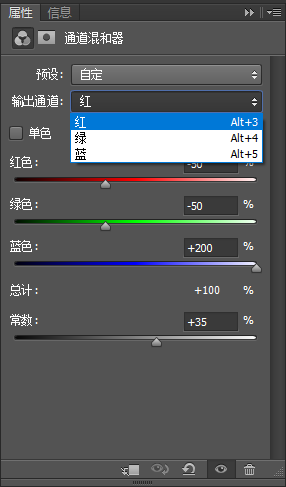

看完之后的状态大概是：道理我都懂，但是这互补色究竟要肿么调能达到想要的效果啊！

答：看经验。（

反正就是看完之后原理也懂了，颜色还是调不出来，于是我想着直接硬怼公式算了。

公式如下：

```
TargetColor.r = SourceColor.r * ParamsR.r + SourceColor.g * ParamsR.g + SourceColor.b * ParamsR.b + ParamsR.const
TargetColor.g = SourceColor.r * ParamsG.r + SourceColor.g * ParamsG.g + SourceColor.b * ParamsG.b + ParamsG.const
TargetColor.b = SourceColor.r * ParamsB.r + SourceColor.g * ParamsB.g + SourceColor.b * ParamsB.b + ParamsB.const
```

首先把目标值分为三个通道，TargetColor.r，TargetColor.g，TargetColor.b

然后每一个通道得到的目标值 = 源颜色.r * 红色滑动条 + 源颜色.g * 绿色滑动条 + 源颜色.b * 蓝色滑动条 + 该通道补正常数。

目标颜色已知，源颜色已知，要求三组 r,g,b,c，头大。

想了几种方案，算下来结果都不对，搜了一圈看到了一个重要信息：**通道参数的总值要为100%**，即 **Params.r+ Params.g+ Params.b=1**(图上总计的那个值)

[关于通道参数为什么合计要是100%](https://forum.xitek.com/thread-1629827-1-1-1.html)

> 为什么要求每个通道内的混合分量百分比之和应当保持为100%，否则会使中性灰偏色？所谓中性灰就是RGB的值相等，即RS=GS=BS=A。以红色通道为例，设Rc=0，则RD=rr+rg+rb+Rc= Rs×%+ GS×%+ BS×%=A(%+%+%)，通道内的混合分量百分比之和为100%时RD=A，否则RD≠A。其他通道原理相同。所以除非有意为之，否则混合分量百分比之和应当保持为100%。用于通道混合器测试研究用的RGB色轮图。
> 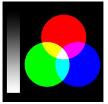

那么就好办了，两个-0.5，一个2，加一起正好是1，然后再用const补齐差值呗。

至于哪个是2，哪些是-0.5，,有三种情况

``` 
TargetColor.r = SourceColor.r * (-0.5) + SourceColor.g * (-0.5) + SourceColor.b * (2) + ParamsR.const
TargetColor.r = SourceColor.r * (-0.5) + SourceColor.g * (2) + SourceColor.b * (-0.5) + ParamsR.const
TargetColor.r = SourceColor.r * (2) + SourceColor.g * (-0.5) + SourceColor.b * (-0.5) + ParamsR.const
```

分别计算一下，求出const最小的值，那么就选这个参数。

还是不知道在说什么，打开PS（和计算器）实战一下（这根本不是实战啊喂！

## 实战

以下图为例，我要把丝袜染成胖次的颜色。（文件夹内有该psd文件，可测试）

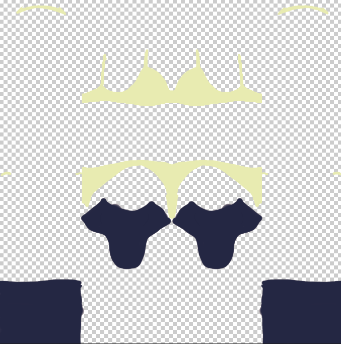

1. 首先吸管取下丝袜和胖次的颜色

源颜色（丝袜）：(36,39,67)

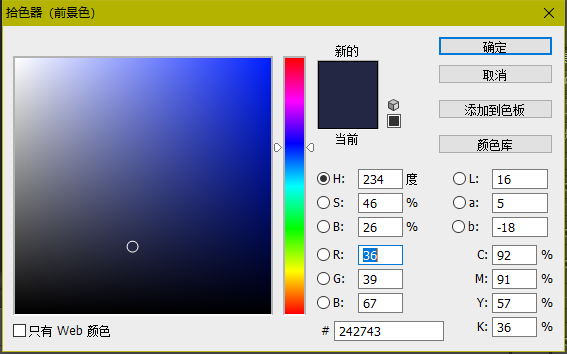

目标颜色（胖次）：(232,235,177)

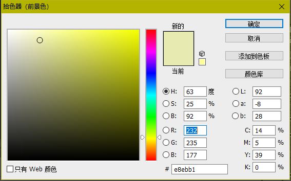

2. 计算R通道三个const值：

   1. ```
      const0 =( 232 - (36 * (-0.5f) + 39 * (-0.5f) + 67 * 2) ) / 255 =  0.53; //之前说的公式需要再除以255得到实际需要的值
      const1 =( 232 - (36 * (-0.5f) + 39 * 2 + 67 * (-0.5f) ) / 255 =  0.78;
      const2 =( 232 - (36 * 2 + 39 * (-0.5f) + 67 * (-0.5f) ) / 255 =  0.83;
      ```

   2. 第一组值最小，所以选用第一组的参数，在ps里设置参数，得到下面结果：

      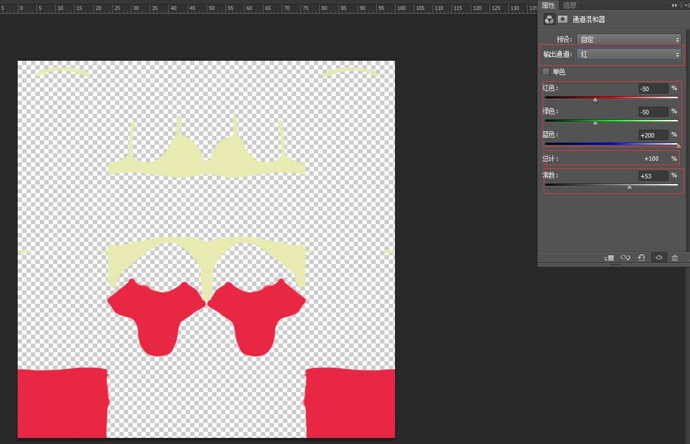

3. 同理算出G通道与B通道的值：

   ```
   constG =( 235 - (36 * (-0.5f) + 39 * (-0.5f) + 67 * 2) ) / 255 =  0.54;
   constB =( 177 - (36 * (-0.5f) + 39 * (-0.5f) + 67 * 2) ) / 255 =  0.31;
   ```

   对应设置G通道之后的效果：

   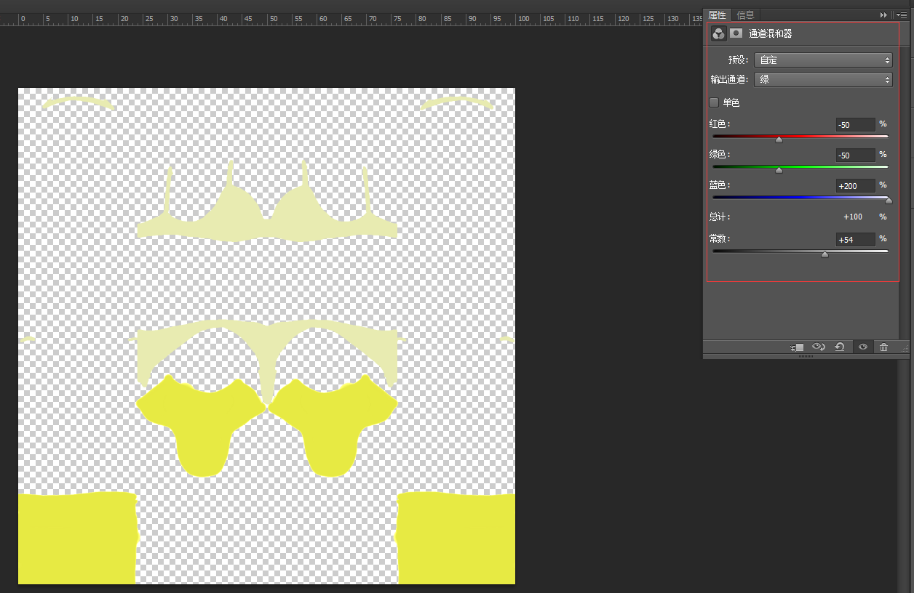

   对应设置B通道之后的效果：

   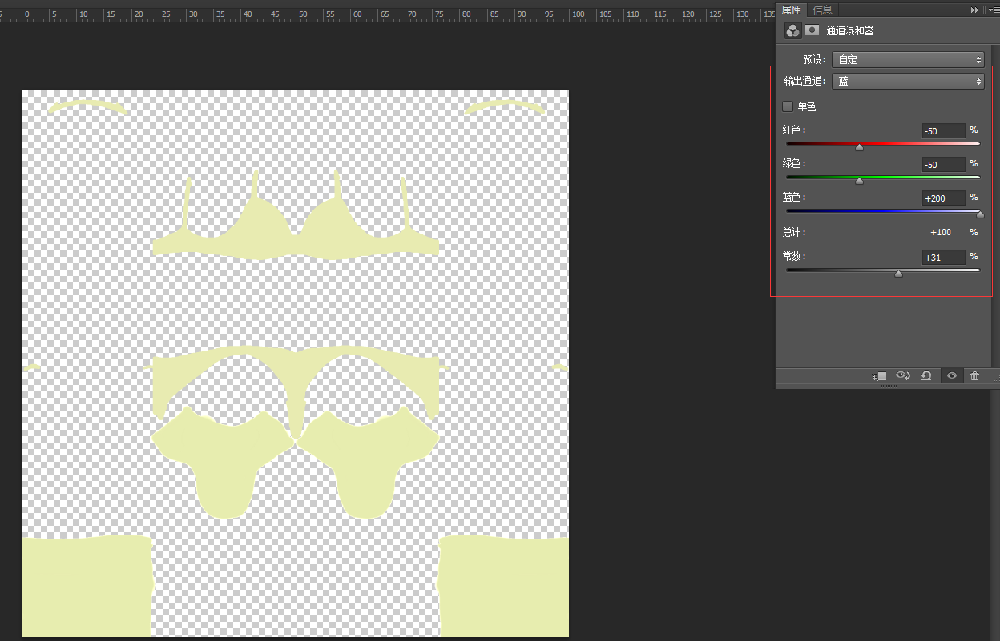

4. 此时再取颜色，查看当前结果

   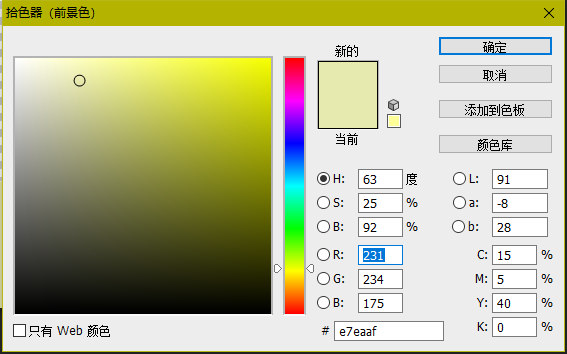

   对比下目标值：

   

   有略微误差，但是基本符合目标。

   ## Code

上面人力实战这部分用代码表示就是：

```c#
// 计算通道参数 
Matrix4x4 CalcMixChannelParams(Color sourceColor, Color targetColor)
    {    	
        Vector4 ret1 = CalcMixChannelParamEx(sourceColor, targetColor[0], 0);

        Vector4 ret2 = CalcMixChannelParamEx(sourceColor, targetColor[1], 1);

        Vector4 ret3 = CalcMixChannelParamEx(sourceColor, targetColor[2], 2);
		//	注意C#中矩阵是列主序，shader中是行主序（被这个基础问题搞了一晚上
        Matrix4x4 ret = new Matrix4x4();

        ret.SetRow(0, ret1);
        ret.SetRow(1, ret2);
        ret.SetRow(2, ret3);   

        return ret;
    }

// 计算单通道参数
Vector4 CalcMixChannelParamEx(Color sourceColor, float targetChannelColorValue, int channel)
    {
        Vector4 ret = Vector4.zero;
        Vector3 colorVec = new Vector3(sourceColor.r, sourceColor.g, sourceColor.b);

        #region 如果每次都计算修改rgb对应的参数的话，当参数处于临界值跳动时，会发生跳色情况
        //float dis0 = targetChannelColorValue - Vector3.Dot(colorVec, paramPresetList[0]);
        //float dis1 = targetChannelColorValue - Vector3.Dot(colorVec, paramPresetList[1]);
        //float dis2 = targetChannelColorValue - Vector3.Dot(colorVec, paramPresetList[2]);

        //List<float> disArray = new List<float>() { dis0, dis1, dis2 };
        //List<float> AbsDisArray = new List<float>() { Mathf.Abs(dis0), Mathf.Abs(dis1), Mathf.Abs(dis2) };

        //int index = AbsDisArray.IndexOf(AbsDisArray.Min());

        //ret.x = paramPresetList[index].x;
        //ret.y = paramPresetList[index].y;
        //ret.z = paramPresetList[index].z;
        //ret.w = disArray[index];
        #endregion

        #region 改为每个Mask的颜色只计算一次rgb通道参数，主要修改const值
        float constValue = 0;
        if (paramPresetIndexList[channel] < 0)
        {
            float dis0 = targetChannelColorValue - Vector3.Dot(colorVec, paramPresetList[0]);
            float dis1 = targetChannelColorValue - Vector3.Dot(colorVec, paramPresetList[1]);
            float dis2 = targetChannelColorValue - Vector3.Dot(colorVec, paramPresetList[2]);

            List<float> disArray = new List<float>() { dis0, dis1, dis2 };
            List<float> AbsDisArray = new List<float>() { Mathf.Abs(dis0), Mathf.Abs(dis1), Mathf.Abs(dis2) };
            paramPresetIndexList[channel] = AbsDisArray.IndexOf(AbsDisArray.Min());
            constValue = disArray[paramPresetIndexList[channel]];
        }
        else
        {
            constValue = targetChannelColorValue - Vector3.Dot(colorVec, paramPresetList[paramPresetIndexList[channel]]);
        }

        ret.x = paramPresetList[paramPresetIndexList[channel]].x;
        ret.y = paramPresetList[paramPresetIndexList[channel]].y;
        ret.z = paramPresetList[paramPresetIndexList[channel]].z;
        ret.w = constValue;
        #endregion

        return ret;
    }
```

算完参数矩阵之后，传到shader中即可，对应shader部分：

```
inline fixed3 channelMixing(fixed3 src, float2 uv)
            {
                half bias = 0.1f;
                fixed4 mask = tex2D(_RecolorMask, uv);
                int maskIndex = (int)(step(bias, mask.r)
                    + step(bias, mask.g) * 2
                    + step(bias, mask.b) * 4);
                fixed4x4 mixingMatrix = _MixingMatrices[maskIndex];

                fixed3 dst = mul((fixed3x3)mixingMatrix, src);
                dst.r += mixingMatrix[0].w;
                dst.g += mixingMatrix[1].w;
                dst.b += mixingMatrix[2].w;
                return dst;
            }
```

最后说下shader中的mask部分。

对于贴图中需要染色的不同部分使用Mask贴图来区分，而Mask的制作方式，是划分每个区域之后，以rgb颜色值的二进制来区分。

以shader中mask计算方式列了如下表格，如表格所示，使用rgb三个通道最多可制作8层Mask，如果使用rgba四个通道则最多可以有16层Mask。

| b    | g    | r    | maskIndex | maskColor |
| ---- | ---- | ---- | --------- | --------- |
| 0    | 0    | 0    | 0         | 黑        |
| 0    | 0    | 1    | 1         | 红        |
| 0    | 1    | 0    | 2         | 绿        |
| 0    | 1    | 1    | 3         | 黄        |
| 1    | 0    | 0    | 4         | 蓝        |
| 1    | 0    | 1    | 5         | 品        |
| 1    | 1    | 0    | 6         | 青        |
| 1    | 1    | 1    | 7         | 白        |

Demo中使用了三层Mask，即黑，红，绿三种颜色。另外一点要注意的是，制作Mask时，边缘不能有渐变，必须是两种颜色中的一种，不然边缘染色会出问题。

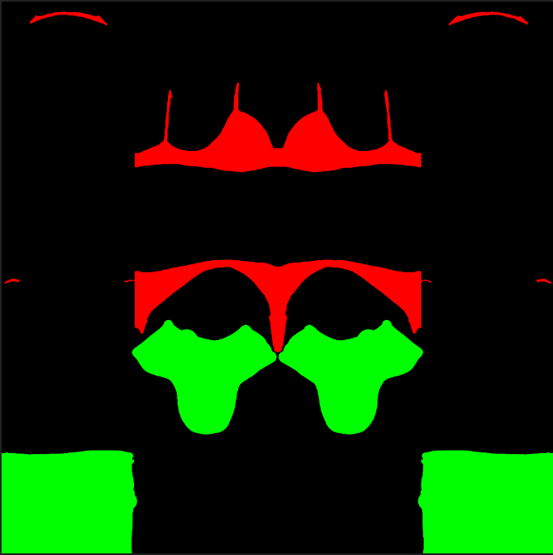

